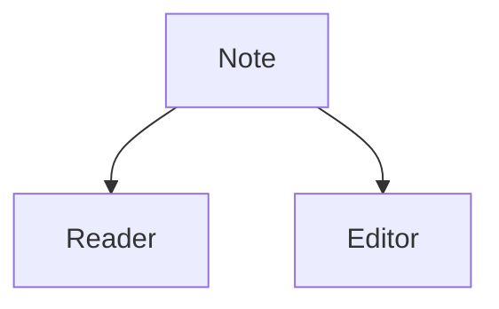

Every note in a cave is a plain Markdown file. Granit renders notes to HTML for reading and gives you a dedicated editor for writing. The filename stem is the note's title and identity — see [[cave-rules]] for the full naming model. This page covers how notes are read, edited, and what frontmatter fields Granit understands.

# Reader and editor

Granit has two views of a note: a rendered reader and an editor.

The **reader** shows the note as formatted HTML rendered by the backend. Headings, lists, tables, links, code blocks, and other Markdown render the way you would expect, and [[wiki-links]] become clickable navigation.

The **editor** is a CodeMirror editing surface for the raw Markdown source. Switch to it when you want to change a note's text. Granit does not use a live-preview editor — you write in the editor and read in the reader, rather than seeing both at once.

# Frontmatter

Notes may begin with a YAML frontmatter block delimited by `---`. Granit parses the frontmatter separately from the body and recognizes these fields:

- `tags` — a list of strings, indexed cave-wide and surfaced in the Tags tab of the [[explorer]].
- timestamps — created and updated times for the note.
- `icon` — an optional icon shown next to the note.
- `favorite` — a boolean flag; favorited notes appear in the Favorites tab of the [[explorer]].

A minimal example:

```markdown
---
tags: [project, draft]
favorite: true
---

# Section heading

Body text starts here.
```

> [!IMPORTANT]
> Frontmatter does **not** set the note's title. The title always comes from the filename stem. See [[cave-rules]] for why filenames are the single source of identity.

# Raw HTML is sanitized

You can write raw HTML inside a note, but Granit sanitizes it before it reaches the reader. Unsafe markup is stripped, so embedded scripts and dangerous attributes will not run. Rely on Markdown and the supported extensions below rather than arbitrary HTML.

# Task-list checkboxes

Markdown task lists render as interactive checkboxes in the reader:

```markdown
- [ ] Draft the outline
- [x] Collect references
```

Toggling a checkbox in the reader writes the change back to the note file. These same tasks are aggregated in the Todo tab — see [[todos]] for details. Note that checkboxes in agent-rendered Markdown are disabled and act as a static display only.

# Mermaid diagrams

Fenced code blocks tagged `mermaid` render as diagrams in the reader:

````markdown

````

This lets you keep flowcharts and other diagrams inline in your notes as plain text.

# Related pages

- [[wiki-links]] — linking notes together and to heading anchors.
- [[templates]] — start new notes from reusable scaffolds.
- [[explorer]] — browse, search, and filter your notes.
- [[configuration]] — fonts, themes, and per-cave settings.
